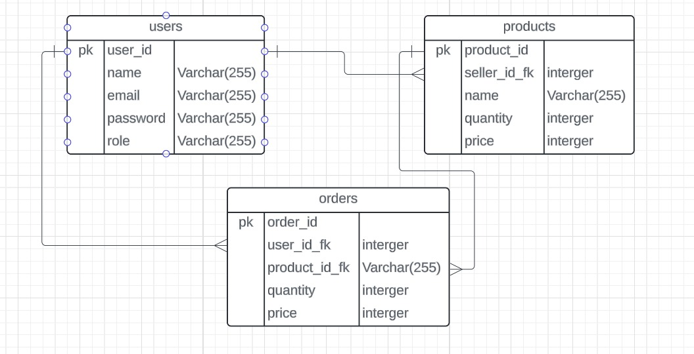

# E-Commerce Platform

Membuat E-Commerce Menggunakan Golang

## Pendahuluan
Proyek ini dikembangkan menggunakan bahasa pemrograman Golang.

## Flowchart

### Penjelasan Flowchart
Flowchart di atas menggambarkan alur kerja dari platform E-Commerce ini, mulai dari interaksi pengguna hingga pemrosesan pesanan. Berikut adalah penjelasan dari tiap bagian dalam flowchart:

1. **User Registration and Login:**
   - Pengguna dapat mendaftar akun baru atau login ke akun yang sudah ada.
   - Sistem akan memverifikasi data pengguna dan mengotorisasi akses mereka.

2. **after login:**
   - Setelah login, pengguna akan mendapatkan akses fitur berdasarkan rolenya.

3. **role buyer atau pembeli:**
   - Pengguna yang memiliki role buyer atau pembeli, memiliki akses untuk:
     1. **melihat product**
     2. **membeli product**
     3. **melihat history pembelian product**

4. **role seller atau penjual:**
   - Pengguna yang memiliki role seller atau penjual, memiliki akses untuk:
     1. **CRUD product**
     3. **melihat list product**

## ERD

### Penjelasan ERD
ERD di atas menggambarkan hubungan antara tiga entitas utama dalam sistem E-Commerce: `users`, `products`, dan `orders`.

#### Tabel Users
- **user_id (PK):** Primary key untuk mengidentifikasi setiap pengguna secara unik.
- **name:** Nama pengguna.
- **email:** Alamat email pengguna.
- **password:** Kata sandi pengguna.
- **role:** Peran pengguna dalam sistem, misalnya pembeli atau penjual.

#### Tabel Products
- **product_id (PK):** Primary key untuk mengidentifikasi setiap produk secara unik.
- **seller_id_fk:** Foreign key yang mengacu ke `user_id` dari tabel `users`, menunjukkan penjual dari produk tersebut.
- **name:** Nama produk.
- **quantity:** Jumlah produk yang tersedia.
- **price:** Harga produk.

#### Tabel Orders
- **order_id (PK):** Primary key untuk mengidentifikasi setiap pesanan secara unik.
- **user_id_fk:** Foreign key yang mengacu ke `user_id` dari tabel `users`, menunjukkan siapa yang melakukan pesanan.
- **product_id_fk:** Foreign key yang mengacu ke `product_id` dari tabel `products`, menunjukkan produk yang dipesan.
- **quantity:** Jumlah produk yang dipesan.
- **price:** Harga total dari pesanan.

### Hubungan Antar Tabel
1. **Users ke Products:**
   - Terdapat hubungan one-to-many antara `users` dan `products`. Satu pengguna (penjual) dapat memiliki banyak produk. Hal ini ditunjukkan oleh foreign key `seller_id_fk` di tabel `products` yang mengacu ke `user_id` di tabel `users`.

2. **Users ke Orders:**
   - Terdapat hubungan one-to-many antara `users` dan `orders`. Satu pengguna (pembeli) dapat membuat banyak pesanan. Hal ini ditunjukkan oleh foreign key `user_id_fk` di tabel `orders` yang mengacu ke `user_id` di tabel `users`.

3. **Products ke Orders:**
   - Terdapat hubungan one-to-many antara `products` dan `orders`. Satu produk dapat muncul di banyak pesanan yang berbeda. Hal ini ditunjukkan oleh foreign key `product_id_fk` di tabel `orders` yang mengacu ke `product_id` di tabel `products`.

### Penjelasan Tambahan
- **Primary Key (PK):** Kolom atau kombinasi kolom yang secara unik mengidentifikasi setiap baris dalam tabel.
- **Foreign Key (FK):** Kolom yang membuat link antara data di dua tabel. Foreign key di satu tabel mengacu ke primary key di tabel lain, sehingga membuat hubungan antara kedua tabel tersebut.

ERD ini membantu dalam memahami struktur database dan hubungan antara tabel-tabel yang ada. Ini sangat penting untuk memastikan integritas data dan efisiensi dalam pengelolaan data dalam sistem E-Commerce.
